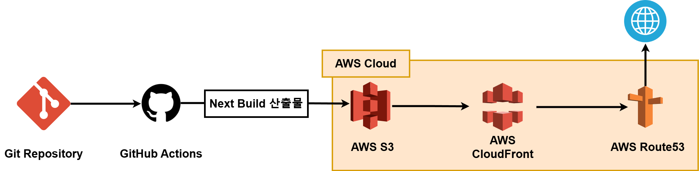
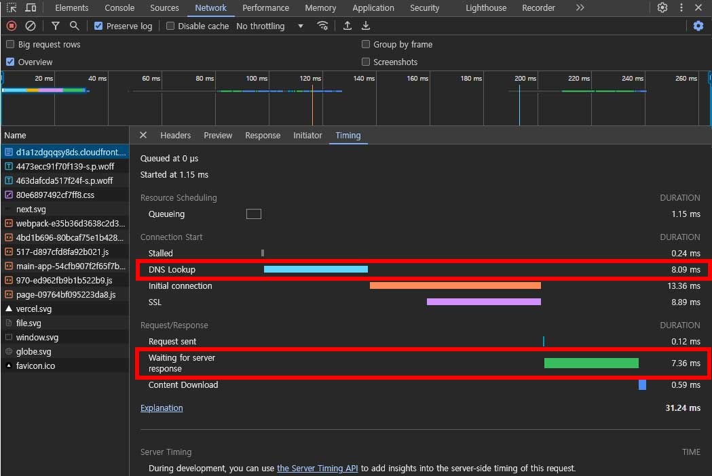
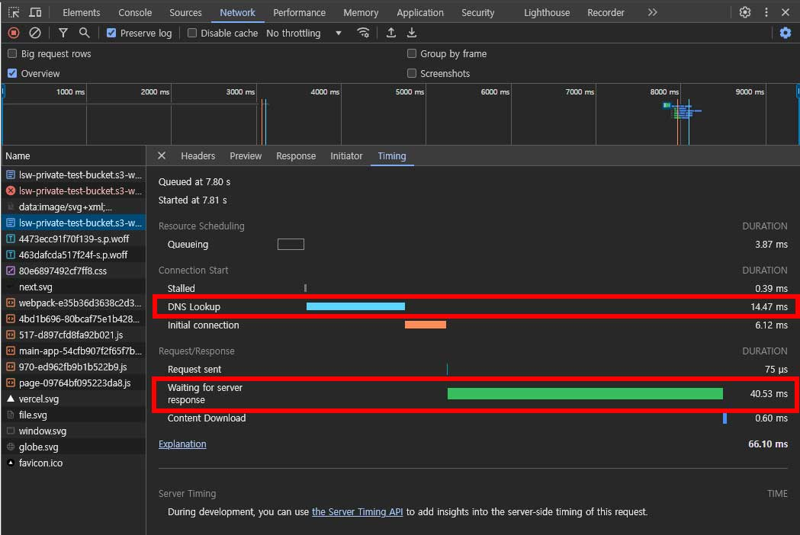
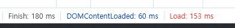
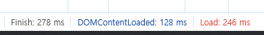
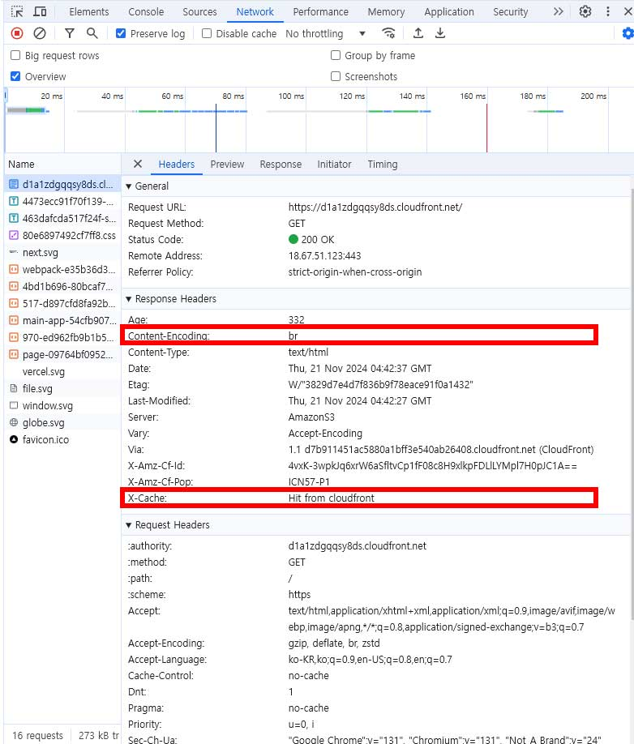
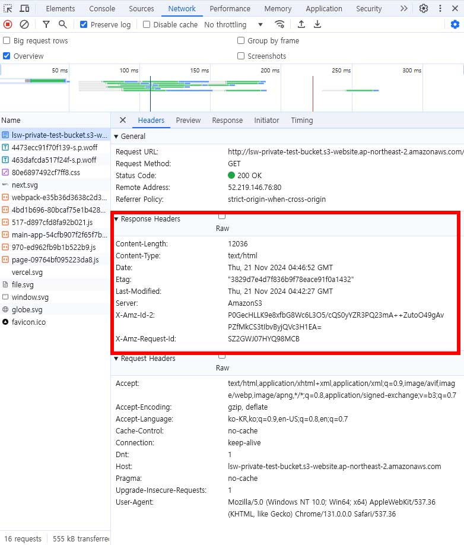
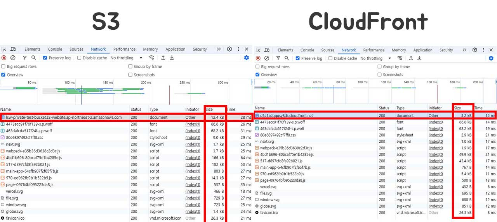

# 배포 파이프라인 설명

#### GitHub Actions와 AWS 서비스를 사용하여 정적 웹사이트를 자동으로 배포하는 CI/CD 파이프라인을 구축.

## 다이어그램

전체 파이프라인의 흐름을 나타낸 다이어그램.

## 주요 구성 요소

1. **GitHub Actions**: CI/CD 파이프라인 실행.
2. **AWS S3**: 빌드된 정적 파일 저장.
3. **AWS CloudFront**: 콘텐츠 배포
4. **AWS Route 53**: 사용자 지정 도메인 관리.

## 사용 방법

1. git clone https://github.com/sangwon1222/aws-nextjs-deploy.git
2. main 브랜치에 코드 push => GitHub Actions 실행.
3. 배포된 결과를 "https://leesw.kr"에서 확인

## 주요 링크

1. S3 버킷 웹사이트 엔드포인트: http://lsw-private-test-bucket.s3-website.ap-northeast-2.amazonaws.com/
2. CloudFront 배포 도메인 이름: https://d1a1zdgqqsy8ds.cloudfront.net

## 주요 개념

1. GitHub Actions과 CI/CD 도구:

- GitHub Actions는 Continuous Integration and Continuous Deployment (CI/CD) 도구로, GitHub 리포지토리 내에서 코드를 자동으로 빌드, 테스트, 배포하는 작업을 설정할 수 있습니다.
- CI/CD는 코드 변경 사항을 지속적으로 통합(Continuous Integration)하고, 변경된 코드를 자동으로 배포(Continuous Deployment)하는 프로세스를 의미합니다.
- GitHub Actions의 주요 특징:
  - .github/workflows 폴더에 YAML 파일로 워크플로를 정의.
  - 코드 푸시, PR 생성 등 특정 이벤트에 반응하여 자동으로 실행.
  - 다양한 공개 액션과 커뮤니티 지원.

2. S3와 스토리지:

- S3(Simple Storage Service):
  - AWS의 객체 스토리지 서비스로, 정적 파일(HTML, CSS, JavaScript 등)을 저장하고 제공하는 데 사용됩니다.
  - 정적 웹사이트 호스팅 기능을 활성화하면 S3 버킷에서 웹사이트를 직접 제공할 수 있습니다.
- 스토리지:
  - 데이터를 영구적으로 저장하고, 인터넷을 통해 빠르게 접근할 수 있도록 하는 서비스.
  - 무제한 확장 가능.
  - 데이터의 안정성 보장.
  - CloudFront와 연동하여 전 세계 사용자에게 콘텐츠를 제공 가능.

3. CloudFront와 CDN:

- CloudFront는 AWS의 Content Delivery Network(CDN) 서비스로, 콘텐츠를 전 세계 엣지 로케이션에서 캐싱하여 사용자와 가까운 위치에서 빠르게 제공합니다.
- CDN(Content Delivery Network):
  - 콘텐츠 전송 네트워크로, 웹사이트의 이미지, 동영상, HTML 파일 등의 정적 및 동적 콘텐츠를 빠르게 전송합니다.
- CloudFront:
  - S3와 연동해 정적 파일 제공.
  - HTTPS 지원(AWS ACM 인증서와 통합).
  - 전 세계 사용자에게 짧은 응답 시간을 제공.
  - DDoS 공격 방지와 같은 보안 기능 제공.

4. 캐시 무효화(Cache Invalidation):

- CDN은 콘텐츠를 엣지 서버에 캐싱하여 전송 속도를 높이지만, 콘텐츠가 변경될 경우 캐시된 데이터를 무효화해야 최신 콘텐츠를 제공할 수 있습니다.
- CloudFront에서 캐시 무효화:
- CloudFront의 캐시 무효화 명령(aws cloudfront create-invalidation)을 실행하여 특정 경로나 전체 콘텐츠(/\*)를 무효화.
- 무효화가 완료되면 모든 엣지 서버에서 최신 콘텐츠를 제공합니다.
- 사용 시점:
  - 코드 업데이트 또는 배포 후 변경된 파일이 즉시 반영되도록 할 때.

5. Repository secret과 환경변수:

- Repository Secret:
  - GitHub Actions에서 사용하는 중요한 데이터를 암호화하여 저장하는 기능.
  - AWS 자격 증명(AWS Access Key, Secret Key)이나 민감한 데이터(API 키 등)를 안전하게 관리.
  - 환경변수:
    - 실행 환경에서 사용하는 변수로, GitHub Actions의 YAML 파일에서 $를 통해 참조.
    - GitHub Secrets와 함께 사용하여 보안성을 유지하면서 워크플로에서 활용.

# 성능

## 비교 도표

| 지표                      | CDN 도입 전 (S3) | CDN 도입 후 (CloudFront) |
| ------------------------- | ---------------- | ------------------------ |
| TTFB (Time To First Byte) | 40.53 (ms)       | 7.36 (ms)                |
| PLT (Page Load Time)      | 246 (ms)         | 153 (ms)                 |
| DNS Lookup Time           | 14.47 (ms)       | 8.09 (ms)                |

### TTFB / DNS Lookup 지표

#### CloudFront

#### S3

### PLT 지표

#### CloudFront

#### S3

## 크기와 서빙 속도

### CloudFront의 네트워크

CloudFront의 응답헤더에는 `Content-Encoding`값과 `X-Cache`이 있는 것을 확인할 수 있다.

`Content-Encoding`: br 헤더는 HTTP 응답이 Brotli 압축 알고리즘을 사용하여 압축되었음을 나타낸다.

`X-Cache`는 CDN(Content Delivery Network) 캐시의 상태를 나타내는 커스텀 HTTP 헤더입니다. Hit from cloudfront는 요청이 처리될 때 Amazon CloudFront의 캐시에서 성공적으로 응답을 찾았음을 의미한다.

### S3의 네트워크

S3의 응답헤더에는 `Content-Encoding`값과 `X-Cache`이 없는 것을 확인할 수 있다.

=> 압축이 안되어 있다.

### S3와 CloudFront 비교

=> CloudFront로 서빙받은 콘텐츠가 Size는 4배정도 작고 응답속도는 2배정도 빠른걸 확인할 수 있다.
